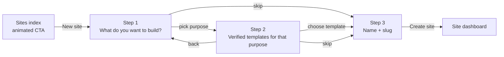
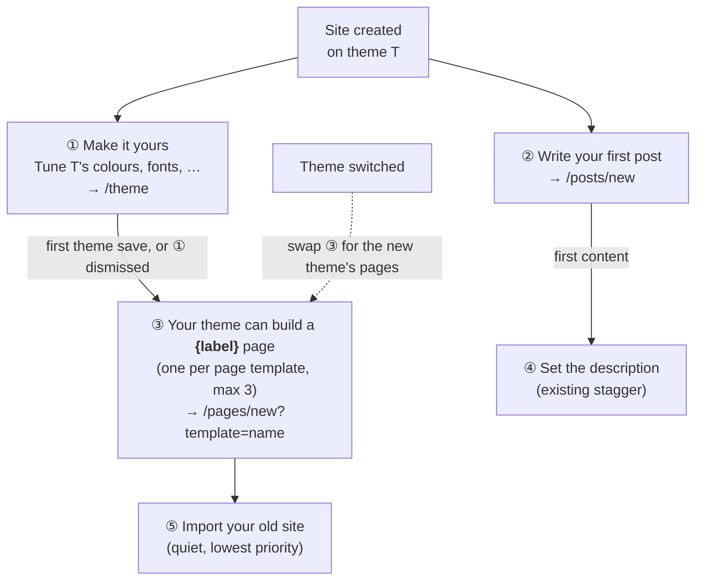

# 2026-10-09 — Plan: Site creation rework (animated entry, "what do you want to build?" wizard, theme-led onboarding todos)

Branch: `feat/site-creation-rework` (from `main` @ `af6e3d2`).

## Context — what exists today

- **Entry point:** `MastheadWeb.AdminLive.SiteIndex`
  (`lib/masthead_web/live/admin/site_index.ex`). "New site" button in the shell
  actions + an illustrated empty state (`empty-sites.svg`) when the user has no
  sites. Both open one static dialog (`.dialog`, `dialog-pop` keyframe) with
  **Name** + **Slug**; slug auto-derives from name until edited.
- **Create:** `Sites.create_site/2` → `do_create_site/2` (`lib/masthead/sites.ex`).
  One `Ecto.Multi`: site + membership + `CreateContact` Oban job, then onboarding
  actions. `attrs_with_default_theme/1` injects the built-in `default` theme when
  no `theme_id` is given.
- **Themes:** `Masthead.Themes.Theme` has `verified`, `public`, `source`
  (`built_in` | `uploaded`), `images` (gallery, first = cover) and `tags`
  (many-to-many, max 3 per theme). `price_cents` exists but nothing reads it —
  the marketplace installs every public theme for free — so the wizard ignores it.
- **Tags:** `theme_tags` seeded by migration `20260919120000` with 32 starter
  tags, a mix of two kinds with no column telling them apart:
  - *purpose*: Blog, Portfolio, Business, Magazine, Personal, Newsletter,
    Documentation, Landing page, Photography, Restaurant, Agency, Nonprofit,
    Podcast, Events, Shop, Resume, Wedding, Education
  - *style*: Minimal, Dark, Light, Colorful, Bold, Elegant, Playful, Retro,
    Serif, Monospace, Image-heavy, Text-focused, Multi-column, One-page
  Admins can rename (slug stays stable) or delete tags.
- **Active-theme invariant:** `Themes.list_themes_for_site/1` lists built-ins +
  themes with a `ThemeInstall` row for the site. A site on an uploaded theme
  **without** an install row would have its active theme missing from the theme
  settings picker → creating a site on an uploaded theme must also install it.
- **Trust gap today:** `Site.create_changeset/2` casts `theme_id` with no
  check, so a crafted `site[theme_id]` could point a new site at any theme,
  including a private one. The wizard must not take `theme_id` from form params.
- **Reusable UI:** `first_image/1`, `placeholder_image/1`, `theme_badge/1`
  (`AdminLive.Components`); marketplace card markup (`.marketplace-card`).
  `prefers-reduced-motion` blocks already exist in `app.css`.
- **Tests:** none cover `SiteIndex` today.

## Goals

1. Make starting a site feel inviting (motion on the entry points + wizard).
2. On "create site", ask **"What do you want to build?"**, map the answer to
   theme tags, show matching **verified** templates, let the user pick one
   instead of Default.
3. A small, unobtrusive **"Skip — use the default theme"** at every
   questionnaire step.
4. Replace the static onboarding todos with a **theme-led flow**: "check out
   your theme settings", then "your theme can make a dedicated X page"
   (Part 2).

Non-goals: paid-theme checkout, AI/free-text matching, onboarding content
seeding per template, changing the theme settings screen.

## Flow

- Step 3 shows the chosen template as a small summary chip ("Template: Aurora ·
  change") so the choice stays visible and reversible.
- If **no purpose tag has a verified theme**, step 1 and 2 are skipped and the
  dialog opens straight on step 3 — never show an empty questionnaire.

## Design

### 1. Data layer (`lib/masthead/themes.ex`)

- `@purpose_tag_slugs ~w(blog portfolio business magazine personal newsletter
  documentation landing-page photography restaurant agency nonprofit podcast
  events shop resume wedding education)`
  `# ponytail: hard-coded purpose list; add a theme_tags.kind column if admins need to manage it`
- `Themes.list_purpose_tags/0` — purpose tags that have ≥1 starter theme, with
  the count, ordered by the list above (one grouped join query).
- `Themes.list_starter_themes(tag_id)` — `source == "uploaded"`, `public`,
  `verified`, tagged `tag_id`, preload `:images`, order by name, `limit: 12`.
- `Themes.starter_theme?(theme)` — same predicate, used to re-check on submit.

### 2. Create (`lib/masthead/sites.ex`)

- `do_create_site/2`: when the resolved theme is `uploaded`, add a
  `ThemeInstall` insert to the same `Multi` so the active theme is listed in the
  site's theme picker. Default/built-in path unchanged.
- Close the trust gap: `SiteIndex` keeps the chosen theme in socket assigns
  (`selected_theme`), never in form params, and re-checks
  `Themes.starter_theme?/1` on save. `"theme_id"` from params is dropped.

### 3. Wizard (`lib/masthead_web/live/admin/site_index.ex`)

Stays one LiveView, one dialog. New assigns: `step` (`:purpose | :template |
:details`), `purpose_tags`, `purpose` (tag), `starter_themes`, `selected_theme`.

Events: `open_modal` (decides first step), `pick_purpose`, `pick_theme`,
`skip` (→ `:details`, `selected_theme: nil`), `back`, existing
`validate`/`save`/`close_modal`.

Markup per step, IDs for tests:
- `#new-site-purpose` — grid of large chip buttons (`#purpose-<slug>`), each
  with a count ("4 templates").
- `#new-site-templates` — marketplace-style cards (`#starter-theme-<id>`),
  reusing `first_image/1`, `placeholder_image/1`, `theme_badge/1`. Card click
  selects; "View" opens `/marketplace/themes/:id` in a new tab.
- `#new-site-form` — existing name/slug form + template summary chip.
- `#new-site-skip` — small muted text button at the bottom-left of steps 1–2.
- Progress: 3 dots in the dialog header.

### 4. Motion (`assets/css/app.css`, CSS only, no JS deps)

Entry points (Goal 1):
- **Empty state:** illustration floats gently (`translateY` loop, ~6s),
  heading/copy/button fade-rise in staggered on mount; the CTA gets a soft
  pulsing glow ring (reuse the `flow-ping` shape).
- **"New site" button (has sites):** shimmer sweep on hover; `+` rotates 90°
  on hover. No idle animation when the user already has sites — that's noise.
- **Site cards:** staggered fade-in on first render (`--i` custom property →
  `animation-delay`).

Wizard:
- Step change: each step container has its own id, so LiveView swaps the
  element and the enter keyframe replays (slide-in from right; from left on
  `back` via a `data-dir` attribute).
- Purpose chips and template cards: staggered rise-in (`--i`), hover lift.
- Selected template: `installed-pop` keyframe + accent ring.
- Create: button shows a spinner via `phx-submit-loading` (`.phx-submit-loading`
  class), no artificial delay.

All new keyframes go in the existing `@media (prefers-reduced-motion: reduce)`
pattern: animations off, transitions instant.

### 5. Tests (`test/masthead_web/live/admin/site_index_test.exs`, new)

Behaviour only:
1. Purpose step lists only purpose tags with a verified, public theme.
2. Picking a purpose shows only matching verified themes (unverified, private,
   other-tag themes absent).
3. Choose template → create → `site.theme_id` is that theme **and** it appears
   in `Themes.list_themes_for_site/1`.
4. Skip → site on Default.
5. No starter themes at all → dialog opens on the details step.
6. Crafted `site[theme_id]` in the save params is ignored.

## Implementation order

1. `Themes` queries + `Sites` install-in-Multi (+ tests 3, 6).
2. Wizard steps in `SiteIndex` (+ tests 1, 2, 4, 5).
3. Motion CSS.
4. Smoke in browser: empty account, account with sites, reduced motion.
5. `mix precommit`.

## Decisions (2026-10-09)

1. **Animation scope:** all three — empty state, "New site" button + site
   cards, and wizard transitions.
2. **Order:** questionnaire first → template → name/slug → Create.
3. **Questions:** one — purpose only. Style tags stay marketplace-only.
4. **Built-ins in step 2:** no; the small skip link is the path to Default.

---

# Part 2: Onboarding todos rework

## Context — what exists today

- **Seeding:** `Sites.maybe_create_onboarding_actions/1` creates three fixed
  actions on every new site: `create_first_post` (prio 100), `create_first_page`
  (100), `import_site` (110). `Actions.reached_first_content/1` adds
  `set_description` after the first post/page lands. Every site gets the same
  list in the same order, whatever theme it is on.
- **Registry:** `Masthead.Actions.Definitions` holds static keys with
  `title`/`message`/`priority`/`cta`/`path`/`remindable`. Unknown keys →
  `create_action/2` returns `{:error, :unknown_key}`.
- **Row:** `Action` already stores its own `title` (custom todos use it) and
  `path`; `action_card/1` renders `Actions.title/1`, the message, and a button
  labeled `Actions.cta/1 || "Open"`. A per-theme todo therefore needs **no
  schema change**: store title/message/path on the row like custom todos do.
- **Completion hooks:** `Content.create_post/…` → `create_first_post`;
  `Content.create_page/…` → `create_first_page`; `SiteImport` →
  `import_site`; `Sites.update_settings/2` → `set_description`.
- **Theme saves:** both token edits and theme switches in `SiteTheme` go
  through `Sites.update_settings/2`, so one hook there sees both.
- **Theme pages:** a theme ships `templates/pages/<name>.liquid` + optional
  `<name>.json` sidecar with `label`/`description`. The names are in the DB
  manifest (`Loader.manifest_page_template_names/1`). Built-in Default ships
  exactly one: `blog`.
- **Page form:** `/:slug/pages/new` always starts on markdown at step 1.
  Picking a template is a click on the Theme page card (`choose_template`);
  there is no URL param to preselect one.
- **Surfaces:** `/:slug/checklist` lists pending actions only (completed ones
  vanish); the dashboard shows the single `top_action`, not dismissible.
  Remindable actions get one reminder email after 7 days.

## Suggested flow

1. **① `customize_theme` — "Make it yours"** (top priority, so the
   dashboard leads with it). The message is built from the theme manifest, e.g.
   *"Aurora has 14 settings — colours, fonts, hero image and more."* (count
   of token fields + the first 2–3 field labels). Links to `/:slug/theme`.
   Done on the first `update_settings` that changes `theme_tokens` or
   `theme_id`. Not remindable.
2. **② `create_first_post`** stays as-is.
3. **③ `theme_page:<name>` — "Your theme can build a Gallery page"**: one per
   page template of the active theme, titled from the sidecar `label`, message
   from its `description` (fallback: *"A dedicated page laid out by {theme}."*).
   Links to `/:slug/pages/new?template=<name>`, which preselects the template.
   Done when a `format: "theme"` page with that template is created.
   **Unlocks only once ① is completed or dismissed**, so the list starts short
   and dismissing ① never hides the pages forever. Not remindable.
   Replaces the generic `create_first_page`; a theme with **no** page
   templates gets `create_first_page` at creation instead.
4. **④ `set_description`** — unchanged stagger after the first content.
5. **⑤ `import_site`** — kept, dropped to the lowest priority so it stops
   leading the dashboard for brand-new sites.

**Theme switch:** on `theme_id` change, `pending` `theme_page:*` todos whose
template the new theme lacks are dismissed and the new theme's pages get
todos. Completed ones are left alone.

### Checklist presentation

Unchanged: the checklist lists pending todos only; done and dismissed ones
disappear. (A progress header + completed list was built and removed — the
checklist is a to-do list, not a progress tracker.)

## Design

### Data / context

- `Definitions`: add `customize_theme`; lower `import_site` priority.
  `customize_theme`'s message is built at creation time from the manifest.
  Easiest: `build_attrs/2` lets a definition's `message` be a function of
  the site, the same way `path` already is.
- `Actions.sync_theme_page_actions(site)` — reads the site's manifest, creates
  missing `theme_page:<name>` rows (title/message/path stored on the row,
  `on_conflict: :nothing` on `(site_id, key)`), and dismisses pending
  `theme_page:*` rows whose template is gone. Used by onboarding and theme
  switch.
  `# ponytail: capped at 3 theme-page todos; lift if themes ship many pages`
- `Sites.maybe_create_onboarding_actions/1`: `customize_theme`,
  `create_first_post`, `import_site`, plus `create_first_page` only when the
  theme has no page templates. Theme-page todos are **not** created here.
- `Sites.update_settings/2`: when the changeset changes `theme_tokens` or
  `theme_id` → `complete_action(site, "customize_theme")` then
  `sync_theme_page_actions(site)` (covers both first save and theme switch).
- `Actions.dismiss_action/2`: dismissing `customize_theme` also runs
  `sync_theme_page_actions(site)`.
- `sync_theme_page_actions/1` is a no-op while `customize_theme` is still
  pending, so a site can't get page todos before ①.
- `Content.create_page/…`: also `complete_action(site_id,
  "theme_page:" <> template)` for theme pages (idempotent; no-op otherwise).

### Web

- `PageForm.mount/3` (`:new`): if `params["template"]` is in
  `page_template_names`, start with the template preselected (reuse the
  `choose_template` draft-seeding). An unknown name is ignored.
- `Checklist` / `action_card/1`: unchanged.

### Tests (behavior)

1. New site on a theme with page templates → `customize_theme`,
   `create_first_post`, `import_site`; no `theme_page:*`, no
   `create_first_page`.
2. Theme without page templates → `create_first_page` present.
3. Saving theme tokens completes `customize_theme` and creates one
   `theme_page:<name>` per template (max 3).
4. Dismissing `customize_theme` also unlocks the `theme_page:*` todos.
5. Switching theme dismisses pending todos for templates the new theme lacks,
   adds the new ones, and keeps completed ones.
6. Creating a theme page with template X completes `theme_page:X`.
7. `/pages/new?template=X` opens with X selected; unknown X → normal start.

## Implementation order

1. `Definitions` (`customize_theme`, function messages, `import_site`
   priority) + `Actions.sync_theme_page_actions/1` + hooks in `Sites` /
   `Content` / `dismiss_action` (+ tests 1–6).
2. `PageForm` `?template=` preselect (+ test 7).
3. (dropped) Checklist progress UI.
4. Smoke: create site on a theme with page templates → save theme → page
   todos appear → create one → checklist ticks it off; repeat with a theme
   switch.
5. `mix precommit`.

## Decisions (2026-10-09)

- **Q-A Unlock timing:** theme-page todos appear after ① is completed (first
  theme save). Dismissing ① also unlocks them, so they can't stay hidden forever.
- **Q-B Generic first page:** replaced by theme-page todos; kept only for
  themes without page templates.
- **Q-C Completed items:** ~~stay visible with a progress header~~ —
  reverted 2026-10-09: done todos disappear, no progress bar.
- **Q-D Existing sites:** new sites only; no backfill.
- **Q-E Reminder emails:** none for the new todos.
